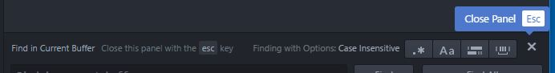

# Deprecated

This will be merged into [find-and-replace](https://github.com/atom/find-and-replace/) in Atom 1.19.0 [#347 (comment)](https://github.com/atom/find-and-replace/issues/347#issuecomment-302483066)

# find-and-replace-close-button package

Add a close button to the find and replace panel.

